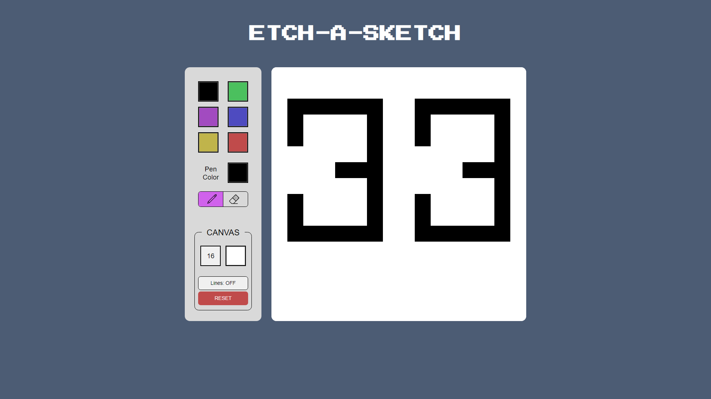
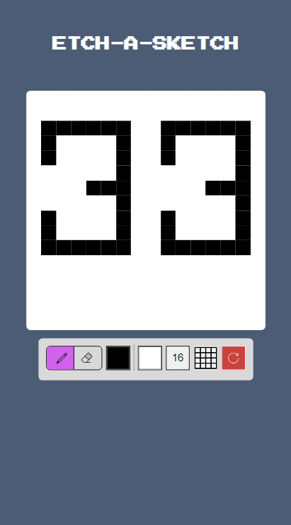

# Etch-A-Sketch

An etch-a-sketch made with JS!

## Features

1. Responsive.
2. Toggle between paint/erase mode.
3. Change pen/grid colour.
4. Customizable grid size.
5. Toggle grid lines on/off.

## Tools used

- jQuery

## Todo

1. Clean up code.
